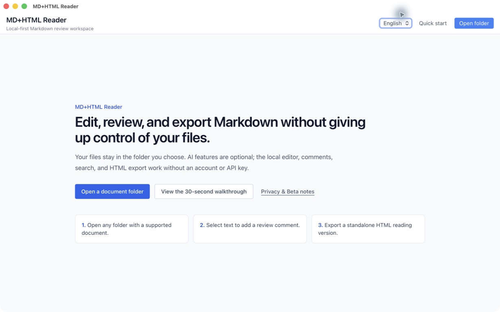

# MD+HTML Reader

[中文](README.zh-CN.md) | English

> A local-first Markdown workspace for editing, reviewing, and exporting shareable HTML.

**Current version:** 0.9.0 · **Platform:** macOS · **Status:** beta

MD+HTML Reader is a macOS desktop app for people who write and review Markdown files. Open a folder you control, edit documents in place, leave anchored comments, then export a standalone HTML reading version. Core editing, comments, search, and export work without an account or API key.



This screenshot was captured from the 0.9.0 development build. [See the known beta limits](BETA_LIMITATIONS.md).

## What you can do

- Edit Markdown with a WYSIWYG editor while keeping files in their original folder.
- View and edit YAML as raw text while preserving its syntax.
- Add anchored review comments stored separately from the source document.
- Search file names and workspace content.
- Export Markdown as standalone HTML, with an optional embedded source view.
- Generate a Chinese translation copy or AI reading version when you explicitly configure and approve an AI provider.

## Try it in 30 seconds

1. Open a folder containing a Markdown or YAML file.
2. Select text and add a comment.
3. Open **Document tools** and export an HTML reading version.

No AI setup is needed for this path.

## Run from source

MD+HTML Reader currently supports **macOS**. To run it from source, install Node.js 24+, pnpm 11.7.0, and Rust 1.96+.

```bash
corepack enable
corepack prepare pnpm@11.7.0 --activate
pnpm install --frozen-lockfile
pnpm exec tauri dev
```

To contribute, start with [CONTRIBUTING.md](CONTRIBUTING.md). The full local verification set is listed below and in the contribution guide.

## Privacy and AI

The app works locally by default. Opening, editing, commenting, searching, and HTML export operate on the folder you choose.

AI tools are optional. Before creating an AI reading version or document-assistant request, the app asks for confirmation and sends only the current Markdown and, where needed, unresolved comments to the provider you choose. The API key is kept in memory for the current session and is not written to disk. See [PRIVACY.md](PRIVACY.md) for the full statement.

## Beta limitations

Comment highlights may be less precise after substantial document edits, and very large documents have not yet been performance-tested. Keep a copy of important work and see [BETA_LIMITATIONS.md](BETA_LIMITATIONS.md) before relying on the app for critical workflows.

## Feedback and support

- Found a defect? [Report a bug](https://github.com/wangml1e4/md-html-reader/issues/new?template=bug-report.yml).
- Have an improvement in mind? [Request a feature](https://github.com/wangml1e4/md-html-reader/issues/new?template=feature-request.yml).
- Tried the macOS beta? [Share beta feedback](https://github.com/wangml1e4/md-html-reader/issues/new?template=beta-feedback.yml).
- Need help using or contributing to the project? Read [SUPPORT.md](SUPPORT.md).
- Found a security issue? Follow [SECURITY.md](SECURITY.md) instead of opening a public issue.

## Release status

This is a macOS beta. Local type checks, frontend tests, Rust tests, and production builds are covered by the project workflow. Developer ID signing, notarization, and notarized-DMG installation verification are still pending; do not represent the current artifact as a fully notarized macOS release. See [RELEASE_CHECKLIST.md](RELEASE_CHECKLIST.md).

## Development checks

```bash
pnpm exec vue-tsc --noEmit
pnpm test -- --run
pnpm build
(cd src-tauri && cargo test)
```

## Product docs

- [Privacy statement](PRIVACY.md) · [中文](PRIVACY.zh-CN.md)
- [Beta limitations](BETA_LIMITATIONS.md) · [中文](BETA_LIMITATIONS.zh-CN.md)
- [Release checklist](RELEASE_CHECKLIST.md)
- [Manual acceptance guide](MANUAL_ACCEPTANCE.md)

## Community

Contributions are welcome. Please read [CONTRIBUTING.md](CONTRIBUTING.md) and follow the [Code of Conduct](CODE_OF_CONDUCT.md). New contributors can look for issues labeled [`good first issue`](https://github.com/wangml1e4/md-html-reader/labels/good%20first%20issue), and maintainers can flag tasks needing outside help with [`help wanted`](https://github.com/wangml1e4/md-html-reader/labels/help%20wanted).

## License

This project is licensed under the [MIT License](LICENSE). You may use, modify, and redistribute the source under its terms.
